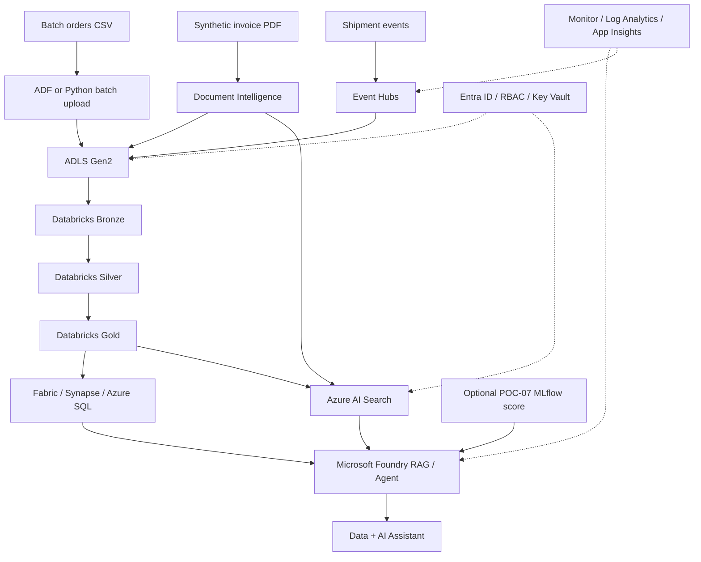

# POC-08 architecture

## Minimal demo interpretation

You do **not** need to reprovision every service from POC-01 through POC-07. Reuse existing Databricks, SQL/Fabric/Synapse, Document Intelligence and Foundry resources when possible. The capstone demonstrates that the pieces work together and that you can explain identity, governance, observability, CI/CD and cost cleanup.
